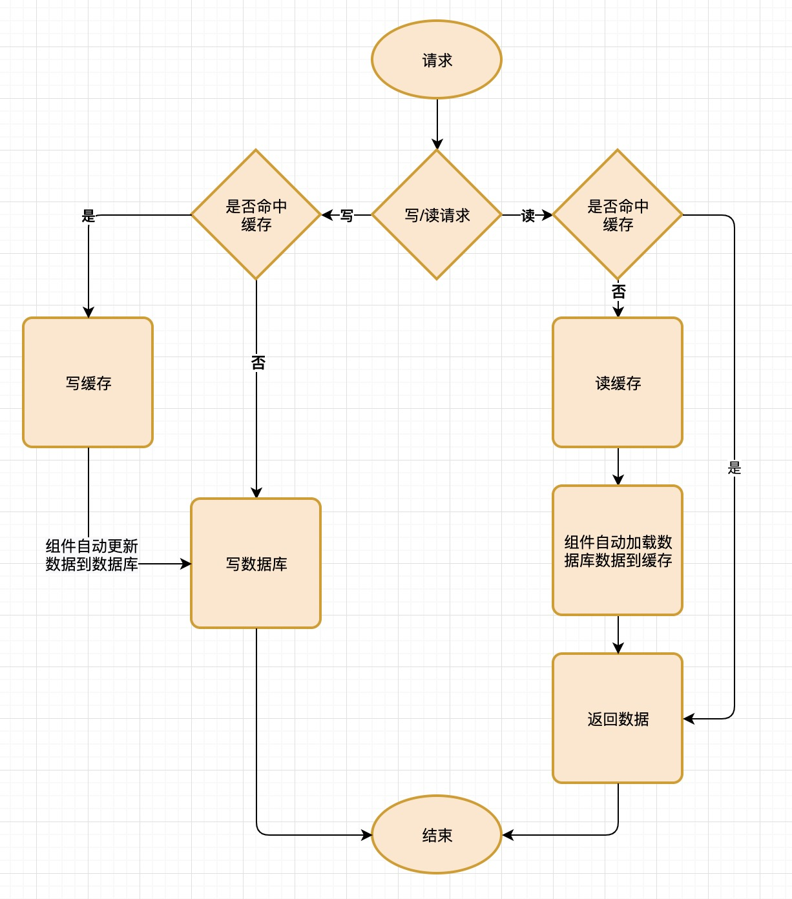
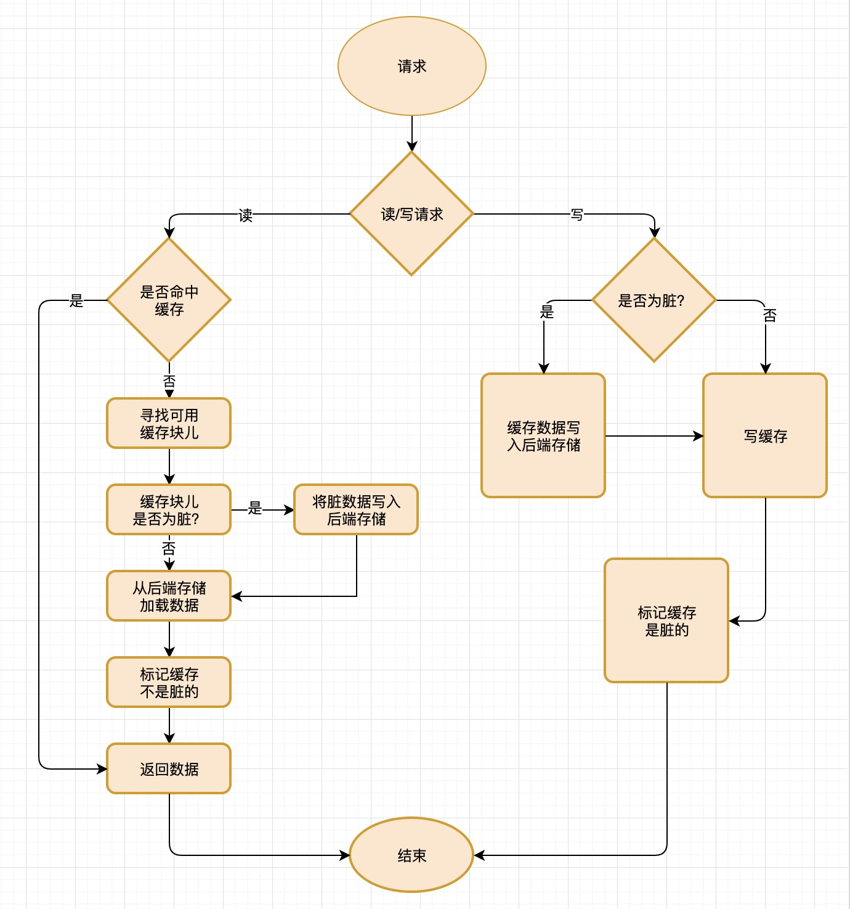
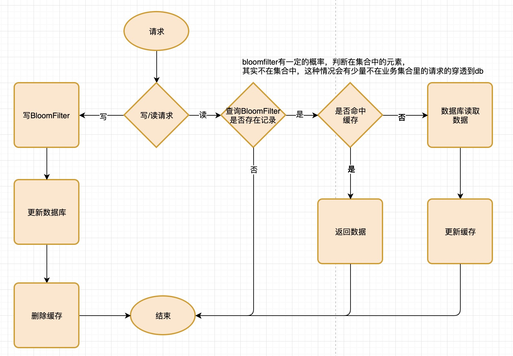

## 缓存策略
### Cache Aside（旁路缓存）策略


##### 读取数据伪代码:
```
    data = get_data_form_cache(identify)
    if data:
        return data
    else:
        data = get_data_form_sor(identify)
        set_data_to_cache(identify, data, expire)
        return data
```
* 先从缓存中获取数据，如果获取到数据（命中缓存），就直接返回数据。
* 如果未获取到数据就从数据库中获取数据，并更新缓存，然后返回数据。

##### 更新数据：
```
    save_update_data_to_sor(identify, update_data)
    delete_data_of_cache(identify)
```
* 将数据更新过的数据保存到数据库中,然后失效对应缓存。


### Read/Write Through（读穿 / 写穿）策略



* 用户代码直接读写缓存，需要中间件支持
* Read/Write Through（读穿 / 写穿）策略 需要缓存中间件支持，常见的redis，memcached 不支持该模式


### Write Back（写回）策略



* 图中其中标记为脏的数据，是新写入的数据，与db数据不一致
* 操作系统使用缓存模式
* 关机之后可能会丢失未保存的数据也是因为使用这种缓存模式的原因


### 其他更具业务场景做的缓存策略
缓存的策略，可以根据自己的业务场景，对脏数据的忍耐度等去做不同的策略

## 缓存穿透问题
>当在缓存里查不到对应信息时，就要从数据库中拉取条目，这种情况叫缓存穿透。当然少量的缓存穿透是正常的。

### 1、Cache Aside策略中的穿透查询
#### 情况
在Cache Aside（旁路缓存）策略中，缓存失效之后，必然有一次穿透查询，这是业务不可避免的。当并发比较大的时候，一次失效可能会有很多查询同时打到db上，这个情况被称为：dog-pile-effect（狗桩效应）

#### 措施
可以是用分布式锁来解决dog-pile-effect（狗桩效应）,使用锁机制保证，在未命中只允许执行一次查询数据库更新缓存的操作。


### 2、查询不存在的记录导致
#### 情况
比如查询商品的详情接口时，如果提交一个系统中存在的商品id，这个时候缓存中查不到数据，就会去数据库查询，就会导致缓存穿透情况。如果这个被别有用心的人利用，对系统进行攻击就会导致后端数据库承受巨大压力。

#### 措施

* 回写空值（要考虑内存使用问题）
* 布隆过滤器
    * 有错误概率，
    bloomfilter判断在集合中的元素可能不在集合中
    但bloomfilter判断不在集合中元素就一定不在集合中。
    对于缓存来说可以很好的利用这个特点。
    顶多出现少量穿透，但不会导致业务逻辑问题。而且达到了过滤的目的
    * 不支持删除元素




ref:
https://github.com/jaybaird/python-bloomfilter/blob/master/pybloom/pybloom.py
https://gist.github.com/marcan/23e1ec416bf884dcd7f0e635ce5f2724
https://cloud.tencent.com/developer/article/1006122


