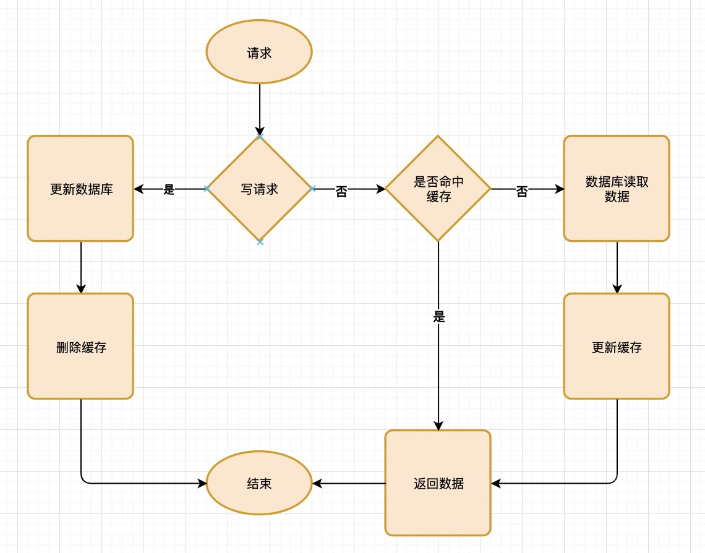

### Cache Aside（旁路缓存）策略




##### 读取数据伪代码:
```
    data = get_data_form_cache(identify)
    if data:
        return data
    else:
        data = get_data_form_sor(identify)
        set_data_to_cache(identify, data, expire)
        return data
```
* 先从缓存中获取数据，如果获取到数据（命中缓存），就直接返回数据。
* 如果未获取到数据就从数据库中获取数据，并更新缓存，然后返回数据。

##### 更新数据：
```
    save_update_data_to_sor(identify, update_data)
    delete_data_of_cache(identify)
```
* 将数据更新过的数据保存到数据库中,然后失效对应缓存。

##### dog-pile-effect:
* 防止缓存失效时，同时有很多个并发请求导致的，数据库压力陡增的问题（dog-pile-effect)
* 通过cache中的key锁保证。


### Read/Write Through（读穿 / 写穿）策略


* 用户代码直接读写缓存，需要中间件支持
* Read/Write Through（读穿 / 写穿）策略 需要缓存中间件支持，常见的redis，memcached 不支持该模式


### Write Back（写回）策略


* 图中其中标记为脏的数据，是新写入的数据，与db数据不一致
* 操作系统使用缓存模式
* 关机之后可能会丢失未保存的数据也是因为使用这种缓存模式的原因


